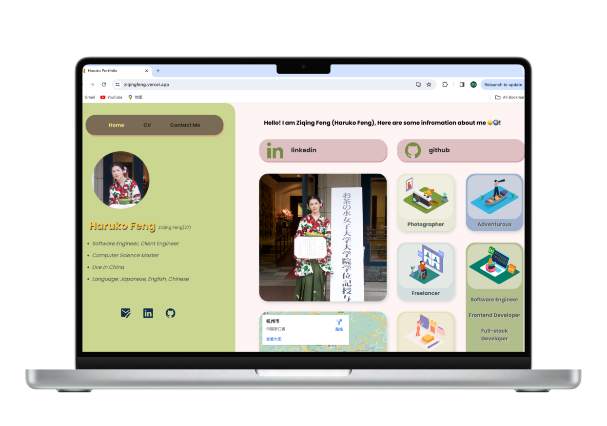
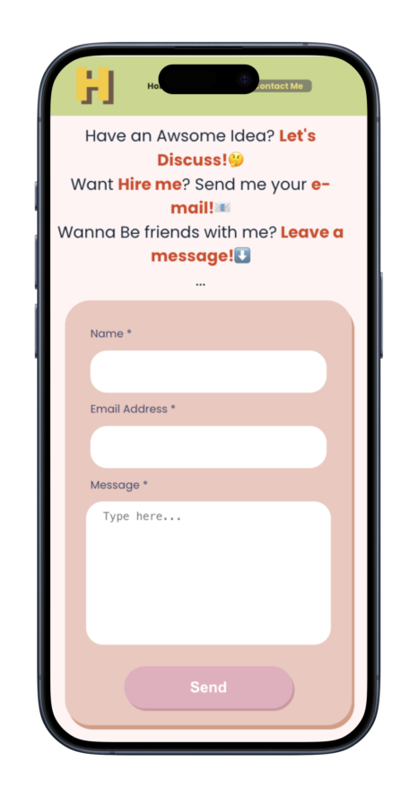
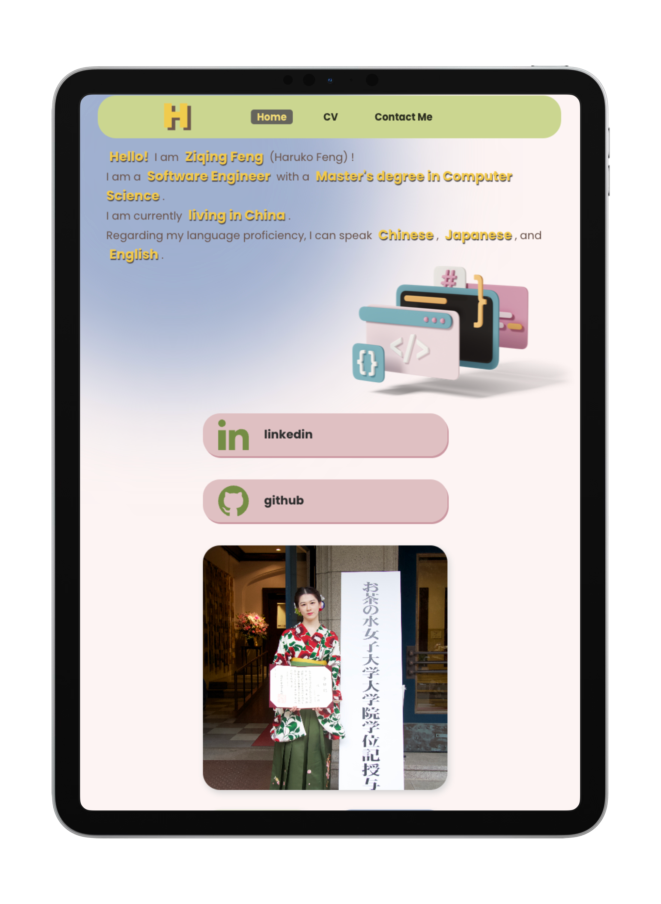
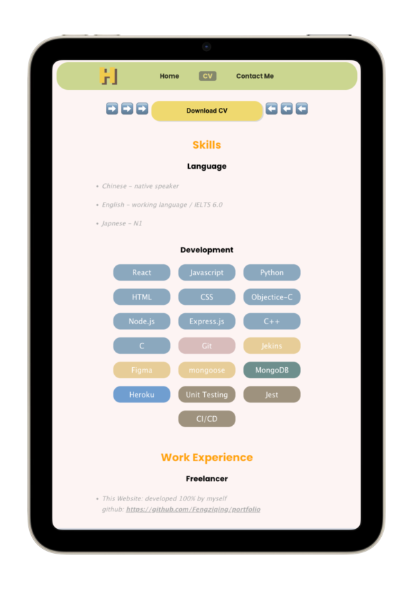
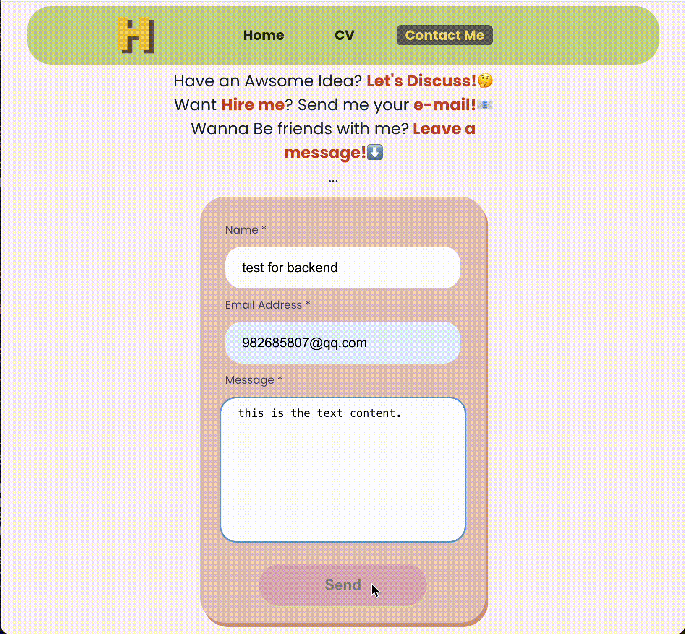
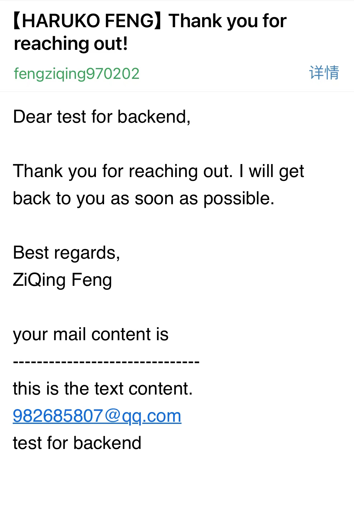

    
    <h1>Haruko Portfoilo Backend</h1>

    
    <h4 >Hello! Welcome to Haruko Feng(ZiQing Feng)'s portfoilo website!  This is the back-end source code.</h4>

## About This Website
### My website address: [Haruko Portfoilo](https://ziqingfeng.vercel.app/ "haruko portfoilo")

**If you access this website from China, you will be blocked, please use VPN. 🪜*

**如果你在中国境内访问这个网站，你会被墙，请使用VPN🪜访问。*

**If you want use this source code, please note my name and this github address on your project.*
### Frontend github: [Haruko Portfoilo-Frontend](https://github.com/Fengziqing/portfolio "haruko portfoilo-frontend")

####

## How does it looks like?
### Responsive Web Design：

MacBook Pro(Home Page)  | iPhone(Contact Me Page)
------------- | -------------
  | 

iPad Pro(Home Page)  | iPad Mini(CV Page)
------------- | -------------
  | 

### Contact Me Page

#### You will receive a email looks like this:

# How to start?

This project was bootstrapped with [Create React App](https://github.com/facebook/create-react-app).

## Available Scripts

In the project directory, you can run:

### `npm start`

Runs the back-end code in the development mode.\
Open [http://localhost:3000](http://localhost:3000) to view it in your browser.

The page will reload when you make changes.\
You may also see any lint errors in the console.

## Learn More

You can learn more in the [Create React App documentation](https://facebook.github.io/create-react-app/docs/getting-started).

To learn React, check out the [React documentation](https://reactjs.org/).
